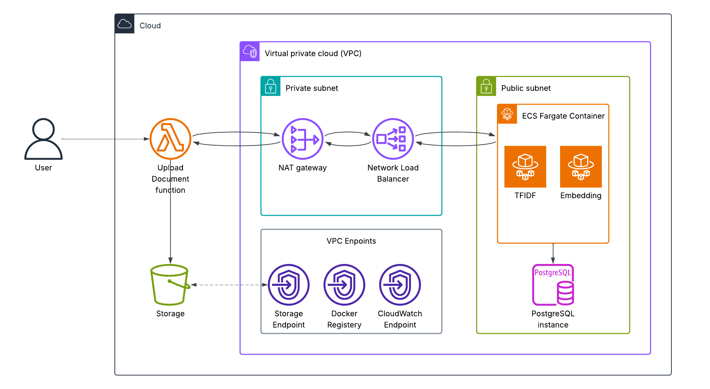

# Near Duplicate Detection API

A production-ready FastAPI service for detecting near-duplicate documents using TF-IDF and semantic embeddings with clustering optimization.

## High-level Architecture
We can discuss this in detail during the interview


## Quick Start

### 🛠️ Developmentrequisites
- Docker and Docker Compose installed
- Git

### Setup and Run

1. **Download the dataset**
   - Go to [Kaggle Near Duplicate Detection Competition](https://www.kaggle.com/competitions/near-duplicates/data)
   - Download the dataset files
   - Create `data/all_docs/` directory if it doesn't exist
   - Extract and place all `.txt` files into the `data/all_docs/` folder

2. **Start the API service**
   ```bash
   docker compose up --build
   ```
   
   **Note:** First run will take **7-10 minutes** to complete initialization:
   - Loading documents (~30 seconds)
   - Creating TF-IDF vectors (~2 minutes)
   - Generating document clusters (~1 minute)
   - Creating semantic embeddings (~5-6 minutes)
   - Subsequent startups are instant (models are cached)

3. **Access the API**
   - API Base URL: `http://localhost:8000`
   - Interactive Docs: `http://localhost:8000/docs` (if you want to test quickly)

4. **Test document upload (optional)**
   ```bash
   # Create new_docs directory if it doesn't exist
   mkdir -p data/new_docs
   
   # Copy an existing document from the dataset
   cp data/all_docs/0.txt data/new_docs/my_document.txt
   
   # Upload the document via API
   curl -X POST "http://localhost:8000/documents" \
     -H "Content-Type: application/json" \
     -d '{"doc_name": "my_document"}'
   ```
   
   **Expected output (duplicate detected):**
   ```json
   {
     "detail": "Document my_document has duplicates: 0"
   }
   ```
   
   The duplicate is detected because the file was copied from an existing document. This demonstrates the duplicate detection working correctly!

5. **Test near-duplicate detection (optional)**
   ```bash
   # Copy a document and make a small modification
   cp data/all_docs/1.txt data/new_docs/modified_document.txt
   
   # Edit the file slightly (e.g., change a few words, add a sentence)
   # You can use any text editor:
   nano data/new_docs/modified_document.txt
   # or
   vim data/new_docs/modified_document.txt
   
   # Upload the modified document
   curl -X POST "http://localhost:8000/documents" \
     -H "Content-Type: application/json" \
     -d '{"doc_name": "modified_document"}'
   ```
   
   **Possible outcomes:**
   
   - **If changes are minor** (e.g., changed 1-2 words):
   ```json
   {
     "detail": "Document modified_document has duplicates: 1"
   }
   ```
   The semantic analysis (Phase 2) detects it as a near-duplicate despite small changes.
   
   - **If changes are significant** (e.g., rewritten several sentences):
   ```json
   {
     "id": "modified_document",
     "content": "modified text...",
     "duplicate_check": {
       "has_duplicates": false,
       "tfidf_duplicates": [],
       "embedding_duplicates": [],
       "max_tfidf_similarity": 0.65,
       "max_embedding_similarity": 0.75
     }
   }
   ```
   Document is accepted as unique since similarity scores are below thresholds (0.7 for TF-IDF, 0.8 for embeddings).

## API Endpoints

### Document Retrieval
```bash
# Get document content
curl "http://localhost:8000/documents/{id}"
```

### Document Upload
```bash
# Upload a new document from data/new_docs folder
# The API will:
# 1. Check for duplicates using both TF-IDF and embeddings
# 2. Reject if duplicates are found (409 Conflict)
# 3. Add document and update all models if no duplicates

# First, place your document file in data/new_docs/my_document.txt
curl -X POST "http://localhost:8000/documents" \
  -H "Content-Type: application/json" \
  -d '{"doc_name": "my_document"}'

# Success Response (201):
{
  "id": "my_document",
  "content": "Document text...",
  "duplicate_check": {
    "has_duplicates": false,
    "tfidf_duplicates": [],
    "embedding_duplicates": [],
    "max_tfidf_similarity": 0.0,
    "max_embedding_similarity": 0.0
  }
}

# Error Response - Duplicate Found (409):
{
  "detail": "Document my_document has duplicates: doc_123, doc_456, doc_789"
}

# Error Response - Already Exists (409):
{
  "detail": "Document my_document already exists in the system"
}

# Error Response - File Not Found (404):
{
  "detail": "Document my_document.txt not found in data/new_docs folder"
}
```

### Document Similarity
```bash
# Find similar documents using TF-IDF
curl "http://localhost:8000/documents/123/similar?method=tfidf&threshold=0.7&limit=10"

# Find similar documents using embeddings  
curl "http://localhost:8000/documents/123/similar?method=embedding&threshold=0.8&limit=5"
```

## Architecture Overview

### Project Structure
```
├── main.py                    # FastAPI application entry point
├── docker-compose.yml         # Container orchestration
├── Dockerfile                 # Container definition
├── requirements.txt           # Python dependencies
├── data/all_docs/             # Document dataset (download from Kaggle)
├── api/                       # FastAPI application layer
│   ├── models.py             # Pydantic data models
│   ├── routes.py             # API endpoints
│   ├── services.py           # Business logic
│   └── lifespan.py           # Application lifecycle & model loading
└── scripts/                   # Core processing modules
    ├── read_data.py          # Document loading
    ├── tfidf.py              # TF-IDF vectorization 
    ├── clustering.py         # K-means clustering for optimization
    ├── embedding.py          # Semantic embeddings
    └── finding_similar_doc.py # Similarity computation
```